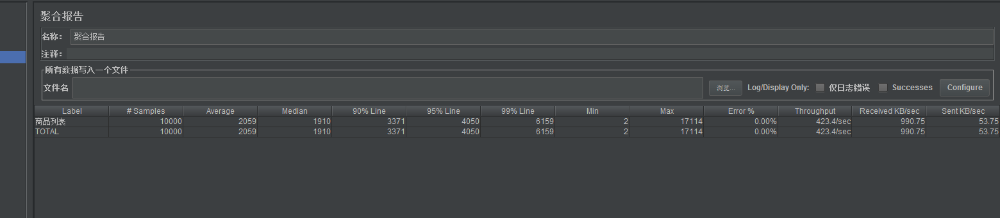
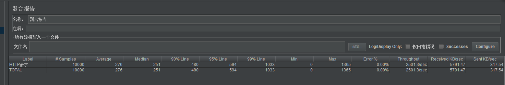

# 项目介绍

本项目是使用Springboot开发框架实现的模拟高并发抢购秒杀系统。

实现了用户管理子系统，商品管理子系统，交易活动子系统，并使用JMeter进行压力测试，在此基础上针对高并发情况进行了一系列的优化、削峰、限流。

# 开发技术

* Springboot+MyBatis+MySql
* Redis+RabbitMq+Guava

# 实现与优化

## 用户管理

### 注册

* 手机号作为账户唯一标识，注册时发送有效时间为1min的5位验证码至用户手机，验证码缓存在redis中；

* 注册时验证输入验证码的有效性，有效则尝试插入数据库user表【手机号字段建立唯一索引】；

* 用户密码使用md5散列算法进行散列，再使用Base64编码进行编码，结果存储在数据库中。

### 登陆

* 使用jwt作为登陆认证框架，手机号和密码验证通过后，产生token返回给客户端；
* 客户端存储token，每次请求时附加在header中；
* 后端设置登录拦截器，验证token的有效性。

## 商品管理

### 查询商品优化

热点数据多级缓存：

* Guava提供的cache模型做本地缓存，缓存在JVM中；
* 本地cache不命中，查询redis；
* redis不命中，查询MySql。

## 交易活动

### 交易流程

### 流程优化

#### 交易验证优化

* 用户、商品、库存、活动等信息缓存在redis中；
* 参数校验通过后发布活动令牌，令牌数不足直接返回。

#### 落单减库存优化

* 商品库存存储在redis中，直接操作redis；
* 使用redis的decrement操作减库存。

#### 商品销量增加

同上减库存优化策略，使用商品销量存储在redis中，使用redis的increment操作加库存。

#### 交易异步化

rabbitmq消息队列异步处理商品库存和商品销量在MySql中的更新。

#### 流量削峰

创建线程池，使用队列进行泄洪。

#### 防刷限流

* 设置验证码，产生交易令牌前验证；
* ratelimiter令牌桶限流算法。

### 结果对比

优化前 ：开启1000个线程循环10次访问，TPS = 423

优化后：TPS = 2501

